# Практическая работа 3.1

## Задание 1

### Задача

Написать запрос на создание 6-7 новых автовладельцев и 5-6 автомобилей, каждому автовладельцу назначить удостоверение и от 1 до 3 автомобилей. Заполнить также ассоциативную сущность "владение".

### Реализация

```python
owners_data = [
        {"last_name": "Ivanov", "first_name": "Ivan", "birth_date": datetime(1985, 5, 15)},
        {"last_name": "Petrov", "first_name": "Oleg", "birth_date": datetime(1990, 3, 10)},
        {"last_name": "Sidorova", "first_name": "Maria", "birth_date": datetime(1988, 7, 22)},
        {"last_name": "Kozlov", "first_name": "Alexey", "birth_date": datetime(1992, 11, 5)},
        {"last_name": "Morozov", "first_name": "Dmitry", "birth_date": datetime(1987, 2, 18)},
        {"last_name": "Lebedeva", "first_name": "Anna", "birth_date": datetime(1995, 9, 12)},
    ]

def create_car_owners():
    
    owners = []
    for data in owners_data:
        owner = CarOwner.objects.create(**data)
        owners.append(owner)
    
    return owners


def create_driver_licenses(owners):
    
    licenses_data = [
        {"license_number": "1234567890", "license_type": "B", "issue_date": datetime(2010, 6, 20)},
        {"license_number": "0987654321", "license_type": "B", "issue_date": datetime(2012, 8, 15)},
        {"license_number": "1122334455", "license_type": "B", "issue_date": datetime(2015, 4, 10)},
        {"license_number": "5544332211", "license_type": "C", "issue_date": datetime(2013, 9, 25)},
        {"license_number": "9988776655", "license_type": "B", "issue_date": datetime(2011, 7, 30)},
        {"license_number": "6677889900", "license_type": "B", "issue_date": datetime(2016, 3, 5)},
    ]
    
    licenses = []
    for owner, license_data in zip(owners, licenses_data):
        license_obj = DriverLicense.objects.create(owner=owner, **license_data)
        licenses.append(license_obj)
    
    return licenses


def create_cars():    
    cars_data = [
        {"state_number": "A123BC", "brand": "Toyota", "model": "Camry", "color": "Red"},
        {"state_number": "B456DE", "brand": "BMW", "model": "X5", "color": "Black"},
        {"state_number": "C789FG", "brand": "Mercedes", "model": "E-Class", "color": "White"},
        {"state_number": "D012HI", "brand": "Toyota", "model": "RAV4", "color": "Red"},
        {"state_number": "E345JK", "brand": "Audi", "model": "A6", "color": "Gray"},
    ]
    
    cars = []
    for data in cars_data:
        car = Car.objects.create(**data)
        cars.append(car)
    
    return cars


def create_ownerships(owners, cars):
    
    ownerships_data = [
        {"owner": owners[0], "car": cars[0], "start_date": datetime(2015, 6, 1), "end_date": None},
        {"owner": owners[0], "car": cars[1], "start_date": datetime(2018, 3, 15), "end_date": None},
        
        {"owner": owners[1], "car": cars[2], "start_date": datetime(2019, 7, 20), "end_date": None},
        
        {"owner": owners[2], "car": cars[3], "start_date": datetime(2020, 1, 10), "end_date": None},
        {"owner": owners[2], "car": cars[4], "start_date": datetime(2010, 5, 5), "end_date": datetime(2015, 8, 12)},
        {"owner": owners[2], "car": cars[0], "start_date": datetime(2010, 1, 1), "end_date": datetime(2015, 5, 31)},
        
        {"owner": owners[3], "car": cars[1], "start_date": datetime(2010, 9, 1), "end_date": datetime(2018, 3, 14)},
        {"owner": owners[3], "car": cars[3], "start_date": datetime(2016, 11, 20), "end_date": datetime(2020, 1, 9)},
        
        {"owner": owners[4], "car": cars[4], "start_date": datetime(2016, 11, 20), "end_date": None},
        
        {"owner": owners[5], "car": cars[2], "start_date": datetime(2021, 5, 15), "end_date": None},
    ]
    
    ownerships = []
    for data in ownerships_data:
        ownership = Ownership.objects.create(**data)
        ownerships.append(ownership)
    
    return ownerships


def display_car_owners():
    print("\n--- CAR OWNERS ---")
    owners = CarOwner.objects.all()
    
    for owner in owners:
        print(f"ID: {owner.id}")
        print(f"Name: {owner.first_name} {owner.last_name}")
        print(f"Date of Birth: {owner.birth_date.date()}")
        
        licenses = owner.licenses.all()
        for lic in licenses:
            print(f"  - Number: {lic.license_number}, Type: {lic.license_type}, Issued: {lic.issue_date.date()}")
        
        ownerships = owner.ownerships.all()
        for ownership in ownerships:
            car = ownership.car
            end_info = f" to {ownership.end_date.date()}" if ownership.end_date else " (current)"
            print(f"  - {car.brand} {car.model} ({car.state_number}, {car.color})")
            print(f"    Owned from {ownership.start_date.date()}{end_info}")
        print()


def display_cars():
    print("\n--- CARS ---")
    cars = Car.objects.all()
    
    for car in cars:
        print(f"ID: {car.id}")
        print(f"Car: {car.brand} {car.model}")
        print(f"State Number: {car.state_number}")
        print(f"Color: {car.color}")
        
        ownerships = car.ownerships.all()
        print(f"Owners ({ownerships.count()}):")
        for ownership in ownerships:
            owner = ownership.owner
            end_info = f" to {ownership.end_date.date()}" if ownership.end_date else " (current)"
            print(f"  - {owner.first_name} {owner.last_name} from {ownership.start_date.date()}{end_info}")
        print()


def display_driver_licenses():
    print("\n--- DRIVER LICENSES ---")
    licenses = DriverLicense.objects.all()
    
    for lic in licenses:
        print(f"ID: {lic.id}")
        print(f"Owner: {lic.owner.first_name} {lic.owner.last_name}")
        print(f"License Number: {lic.license_number}")
        print(f"Type: {lic.license_type}")
        print(f"Issue Date: {lic.issue_date.date()}")
        print()


def display_ownerships():
    print("\n--- OWNERSHIPS ---")
    ownerships = Ownership.objects.all()
    print(f"Total: {ownerships.count()} ownerships\n")
    
    for ownership in ownerships:
        end_info = f" to {ownership.end_date.date()}" if ownership.end_date else " (current)"
        print(f"ID: {ownership.id}")
        print(f"Owner: {ownership.owner.first_name} {ownership.owner.last_name}")
        print(f"Car: {ownership.car.brand} {ownership.car.model} ({ownership.car.state_number})")
        print(f"Period: from {ownership.start_date.date()}{end_info}")
        print()


def display_all_data():
    display_car_owners()
    display_cars()
    display_driver_licenses()
    display_ownerships()


def main():    
    owners = create_car_owners()
    
    licenses = create_driver_licenses(owners)
    
    cars = create_cars()
    
    ownerships = create_ownerships(owners, cars)
    
    display_all_data()


if __name__ == "__main__":
    main()
```

### Результат выполнения
**Владельцы**:

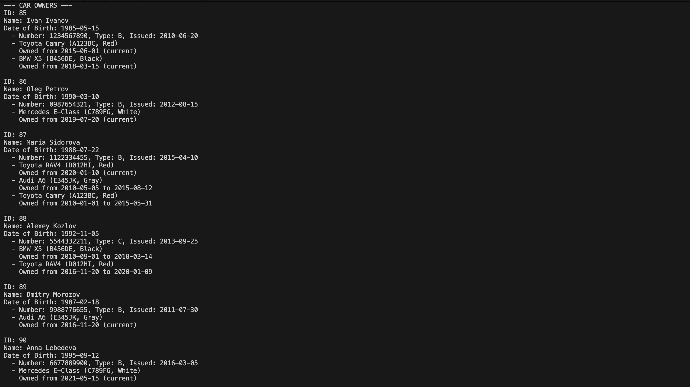

**Машины**:

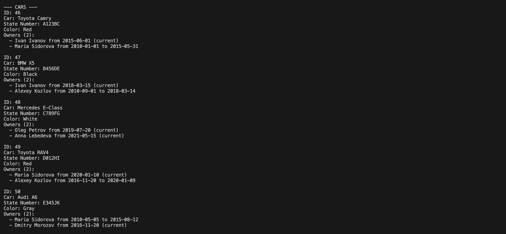

**Владения**:

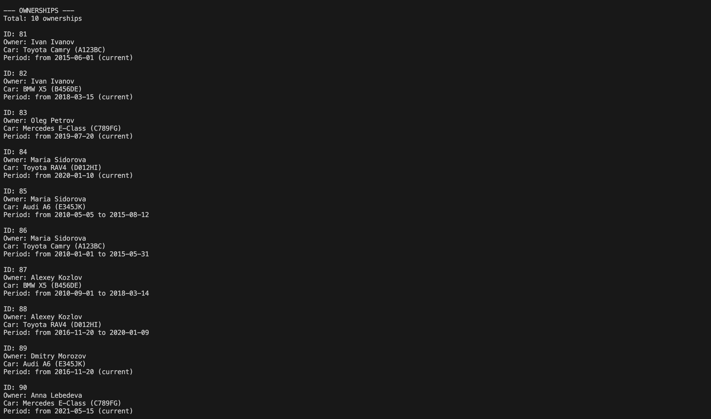

**Удостоверения**:

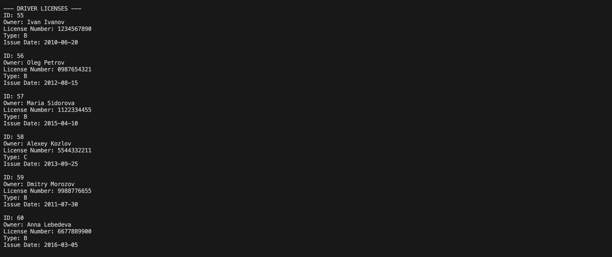
---

## Задание 2

### Задача

По созданным данным написать следующие запросы на фильтрацию:

1. Вывести все машины марки "Toyota"
2. Найти всех водителей с именем "Maria"
3. Взяв случайного владельца получить его ID, и по этому ID получить экземпляр удостоверения
4. Вывести всех владельцев красных машин
5. Найти всех владельцев, чей год начала владения машиной начинается с 2010

### Реализация
```python
from owners.models import CarOwner, Car, DriverLicense, Ownership
from datetime import datetime
from typing import Optional


def get_cars_by_brand(brand: str) -> Optional[Car]:
    cars = Car.objects.filter(brand=brand)
    return cars


def get_owner_by_name(name: str) -> Optional[CarOwner]:
    owners = CarOwner.objects.filter(first_name__contains=name)
    return owners


def get_owner_and_license():
    owner = CarOwner.objects.order_by('?').first()
    license = DriverLicense.objects.filter(owner=owner.id)
    return license


def get_owners_by_car_color(color: str) -> Optional[CarOwner]:
    cars = Car.objects.filter(color=color)
    owners = []
    for car in cars:
        ownerships = Ownership.objects.filter(car=car.id, end_date=None)
        for ownership in ownerships:
            owner = ownership.owner
            owners.append(owner)
    return owners


def get_owners_by_ownership_start_year(year: int) -> Optional[CarOwner]:
    ownerships = Ownership.objects.filter(start_date__gte=datetime(year, 1, 1))
    return set([ownshp.owner for ownshp in ownerships])


def main():
    print(get_cars_by_brand("Toyota"))
    print(get_owner_by_name("Maria"))
    print(get_owner_and_license())
    print(get_owners_by_car_color("Red"))
    print(get_owners_by_ownership_start_year(2010))


if __name__ == "__main__":
    main()
```

### Результаты выполнения

#### Запрос 1: Все машины марки "Toyota"

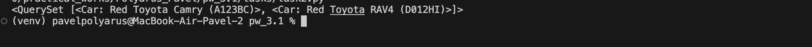

#### Запрос 2: Водители с именем "Maria"

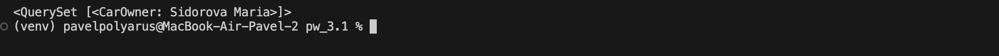

#### Запрос 3: Удостоверение случайного водителя

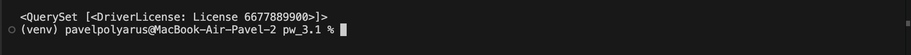

#### Запрос 4: Владельцы красных машин

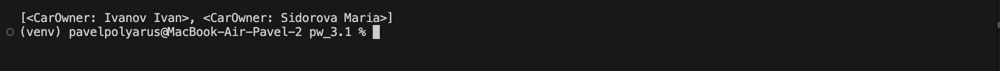

#### Запрос 5: Владельцы, начавшие владеть машиной не раньше 2010 года

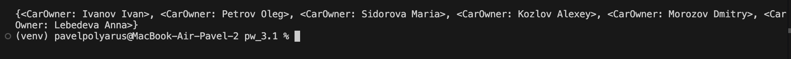

---

## Задание 3

### Задача

Реализовать следующие запросы с применением методов агрегации и аннотации:

1. Вывод даты выдачи самого старшего водительского удостоверения
2. Указать самую позднюю дату владения машиной
3. Вывести количество машин для каждого водителя
4. Подсчитать количество машин каждой марки
5. Отсортировать всех автовладельцев по дате выдачи удостоверения

### Реализация
```python

from owners.models import CarOwner, Car, DriverLicense, Ownership
from typing import Dict, List
from django.db.models import Min, Max, Count, Q


def get_oldest_license() -> DriverLicense:
    return DriverLicense.objects.aggregate(Min('issue_date'))


def get_latest_ownership() -> Ownership:
    return Ownership.objects.aggregate(Max('start_date'))


def get_cars_count_by_owner() -> Dict[CarOwner: int]:
    owners = CarOwner.objects.annotate(
        cars_count=Count('ownerships'),
        filter=Q(ownerships__end_date__isnull=True)
        )
    return {owner: owner.cars_count for owner in owners}


def count_cars_by_brand() -> List[dict]:
    cars = Car.objects.values('brand').annotate(Count('id'))
    return cars


def get_drivers_by_licenses_date():
    drivers = CarOwner.objects.order_by('licenses__issue_date').distinct()
    return drivers


def main():
    print(get_oldest_license())
    print(get_latest_ownership())
    print(get_cars_count_by_owner())
    print(count_cars_by_brand())
    print(get_drivers_by_licenses_date())


if __name__ == "__main__":
    main()
```

### Результаты выполнения

#### Запрос 1: Самое старое водительское удостоверение

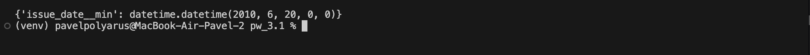

#### Запрос 2: Самая поздняя дата начала владения

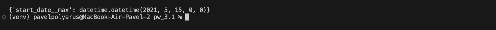

#### Запрос 3: Количество машин у каждого владельца

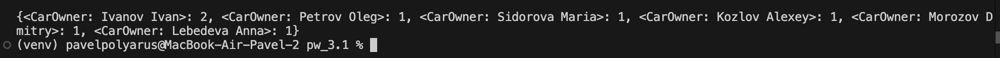

#### Запрос 4: Количество машин каждой марки

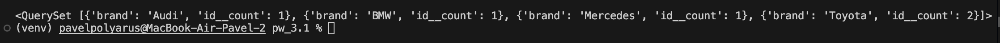

#### Запрос 5: Владельцы отсортированные по дате выдачи удостоверения

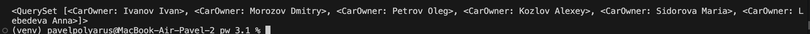
